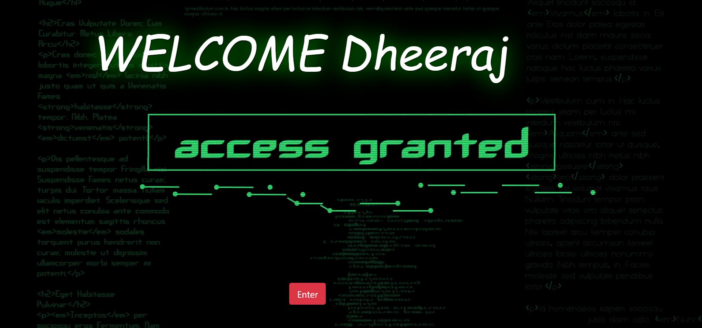

# DBMS-Project
DBMS Project on Forensic Evidence Management and Investigation System. Performs storing of forensic reports, evidences, and image processing operations like matching of evidences stored in the database.

## Requirements

  * Apache 2.4
  * MySQL 5.7
  * PHP 7.2
  * For Image Processing functions, PHP ImageMagick-7.0.7 extension

## Screenshots

